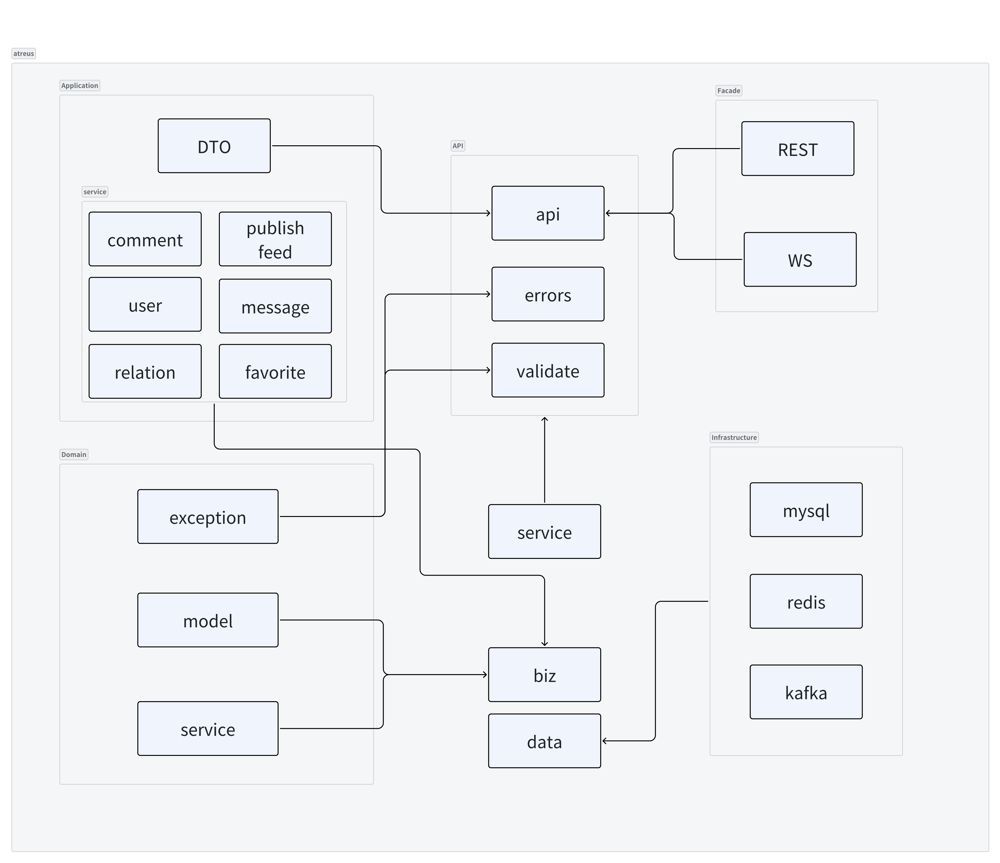

# Atreus

[English](README.md) | [中文](README_cn.md)

**Atreus** is a high-concurrency and high-performance short video microservice application server built with **Kratos**.

- **high-performance**: Use redis for high performance and high speed reads at the memory level. Uses minio for millisecond upload storage.
- **high-concurrency**: Use Kafka as an efficient asynchronous message processing tool to improve system throughput and stability.

## Project Structure

Atreus is refer to [Kratos Layout](https://github.com/go-kratos/kratos-layout). The design concept is based on **DDD**.


```
❯ tree -L 1
.
├── LICENSE
├── README.md
├── README_cn.md
├── _data           // store all services and component data.
├── api             // `.proto` API files and the `pb.go` files which generated.
├── app             // services implements
├── configs         // configuration files for docker.
├── docker
├── third_party     // third_party proto  for api dependencies
├── pkg             // third-party and universal packages
├── middleware      // custom middleware
├── docs
├── Makefile
├── make
├── go.mod
└── go.sum
```

**App** structure

```
.
├── cmd             // the entry point of the services
│   ├── main.go
│   ├── wire.go     // wire library is for dependency injection
│   └── wire_gen.go
├── configs         // configuration files for local development.
└── internal        // business logic implements
    ├── biz         // the layer for composing business logics.
    ├── conf        // the structure for configuration parsing, generated from .proto file
    ├── data        // for accessing data sources.
    ├── server      // the creation of http and grpc instance.
    └── service     // the service layer which implements API definition.
```

## Tech Stack

- [Kratos](https://github.com/go-kratos/kratos)
- [MySQL](https://www.mysql.com/)
- [GORM](https://github.com/go-gorm/gorm)
- [Redis](https://github.com/redis/go-redis)
- [Kafka](https://github.com/segmentio/kafka-go)
- [Minio](https://github.com/minio/minio)

## Get Started

We build the project in Docker. You just run the following command:

```
make docker-compose-up
```

> Attation! You need change the value of field `endpointExtra` in minio configation to your local host ip. File in `/configs/service/publish/config.yaml`.

## How to Contribute

Read [issue](https://github.com/toomanysource/atreus/issues/103) first. You can view more details to [contribute](./docs/contribute).

## Contributors

- [alilestera](https://github.com/alilestera)
- [intyouss](https://github.com/intyouss)
- [mo3et](https://github.com/mo3et)
- [Dyamidsteve](https://github.com/Dyamidsteve)
- [meguminkin](https://github.com/meguminkin)
- [FirwoodLin](https://github.com/FirwoodLin)
- [Li1Mo0N](https://github.com/Li1Mo0N)

## License

Atreus is open-sourced software licensed under the [Apache License 2.0](./LICENSE).
