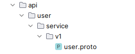
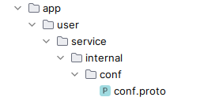

如果你是针对已存在的proto文件，修改message或者service的定义或者注释，那么可以移步到**步骤三**。

# 步骤一：确保proto文件的路径满足要求

假设你想新建一个服务，并为这个服务创建了一个proto文件用以定义API。那么在生成代码之前，请确保该proto文件位于项目顶层目录下的api目录中，并按照规定的次级目录定义放置这个proto文件。
规定的次级目录定义为：`{服务名}/service/{版本号}/{proto文件}`

- 目前开发阶段要求的版本号暂定都是v1

例如user服务的user.proto文件，那么相对于项目顶层目录的路径就应该是 `api/user/service/v1/user.proto`



如果是服务内的proto文件，由于一般服务内涉及到的proto文件只与服务的配置相关，所以这里就以此来展开。请确保该proto文件位于项目顶层目录下的app目录中，并按照规定的次级目录定义放置这个proto文件。
规定的次级目录定义为：`{服务名}/service/internal/conf/{proto文件}`
例如user服务配置的conf.proto，那么相对于项目顶层目录的路径就应该是 `app/user/service/internal/conf/conf.proto`



# 步骤二：确保proto文件内的包定义满足要求
假如是一个服务的API定义，`package`要定义为`{服务名}.service.{版本号}`，同时，必须定义`go_package`，并且要定义为`github.com/toomanysource/atreus/api/{服务名}/service/{版本号};{版本号}`
同样以user服务的user.proto文件为例：

- `package`定义为`user.service.v1`
- `go_package`定义为`github.com/toomanysource/atreus/api/user/service/v1;v1`
```protobuf
// ...
package user.service.v1;

option go_package = "github.com/toomanysource/atreus/api/user/service/v1;v1";
// ...
```

如果是服务内的proto配置文件，`package`要定义为`{服务名}.service.internal.conf` ，同时，必须定义`go_package`，并且要定义为`github.com/toomanysource/atreus/app/{服务名}/service/internal/conf;conf`
同样以user服务配置的conf.proto文件为例：

- `package`定义为`user.service.internal.conf`
- `go_package`定义为`github.com/toomanysource/atreus/app/user/service/internal/conf;conf`
```protobuf
// ...
package user.service.internal.conf;

option go_package = "github.com/toomanysource/atreus/app/user/service/internal/conf;conf";
// ...
```

# 步骤三：生成代码
**注意前提环境：启用Docker**

如果你已经把前面的两个步骤完成了，或者你只是修改message或者service的定义或者注释，那么你可以直接执行
```bash
make proto
```
这个命令会先构建生成proto代码的镜像并用此镜像启动一个容器，用以生成api和app目录下的全部proto文件的代码，并将这些代码文件跟proto文件放置在同一个目录下。

- 生成的代码：
   - `.pb.go`
   - `_grpc.pb.go`（如果定义了service）
   - `_http.pb.go`（如果在service中定义了http api)

# 步骤四：编写其余的代码
到这里你就可以愉快地编写代码了～
